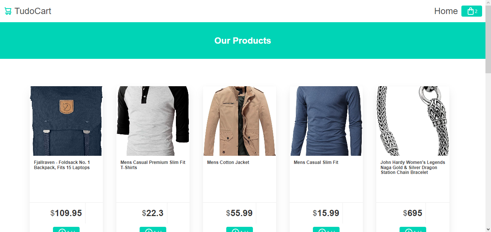
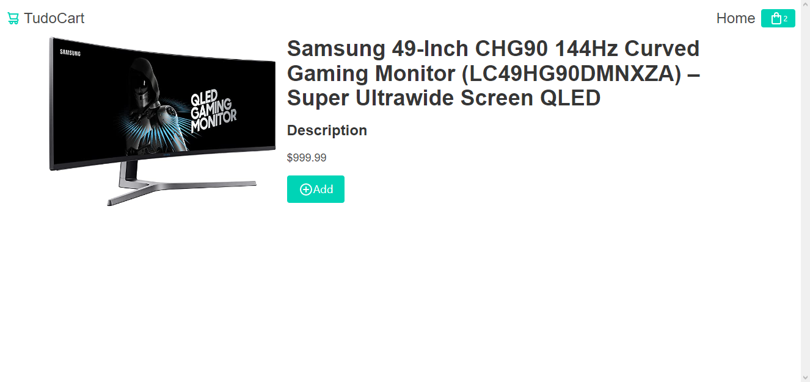
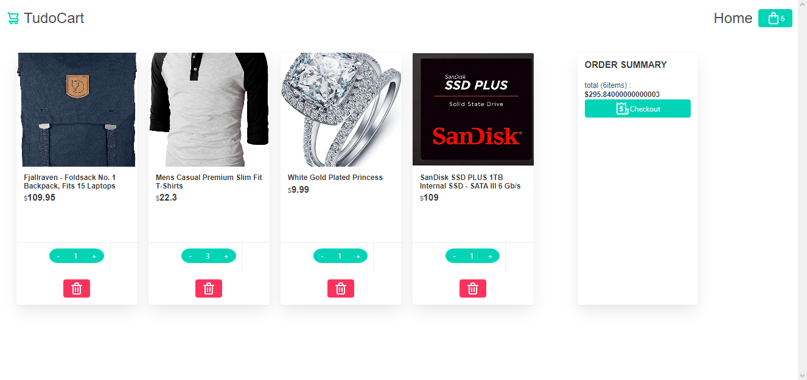

## Ecommerce app React, Redux toolkit, with fake store api, axios, redux preserve

## Table of Contents

* [About the Project](#about-the-project)
* [Built With](#built-with)
* [Getting Started](#getting-started)
* [Contributing](#contributing)
* [Authors](#author)
* [Acknowledgements](#acknowledgements)

## About Project
## Screenshots




## [Live Demo](https://shopping-cart-75h6g1re0-ksigei.vercel.app/)


## Built With

* ReactJS
* Redux
* React Hooks
* React Router
* Axios
* Bulma and Sass
* Preserve State

## Getting Started

* Clone this repo <https://github.com/ksigei/shopping_cart.git>

    ```bash
    git clone https://github.com/ksigei/shopping_cart.git
    ```

* Navigate to shopping_cart folder/directory

    ```bash
    cd shopping_cart
    ```

* On the comandline, at the project's root, run ```npm install``` or ```yarn install``` to install app dependencies

* Next, run ```npm start``` or ```yarn start``` which will run the app in the development mode.

* Open [http://localhost:3000](http://localhost:3000) to view it in the browser.

* ALTERNATIVELY

  * Just run ```npm run build``` or ```yarn build``` which will build the project and generate output files into the ```build``` directory.

  * Go to ```build``` directory and manually open ```index.html``` to interact with the app


## Contributing

Contributions, issues, and feature requests are welcome!

Feel free to check the [issues page](../../issues)

  1. Fork the Project
  2. Create your Feature Branch (`git checkout -b feature/newFeature`)
  3. Commit your Changes (`git commit -m 'Add some newFeature'`)
  4. Push to the Branch (`git push -u origin feature/newFeature`)
  5. Open a Pull Request

## Author

👤 **Sigei Kiprono**

- GitHub: [@ksigei](https://github.com/ksigei)
- LinkedIn: [Kiprono Japhet](https://www.linkedin.com/in/kiprono-japhet/)

## Acknowledgements


## Show your support

Give a ⭐️ if you like this project!
